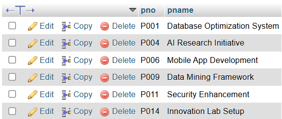
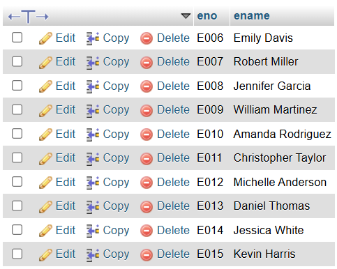
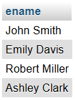
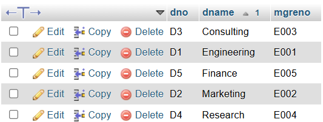
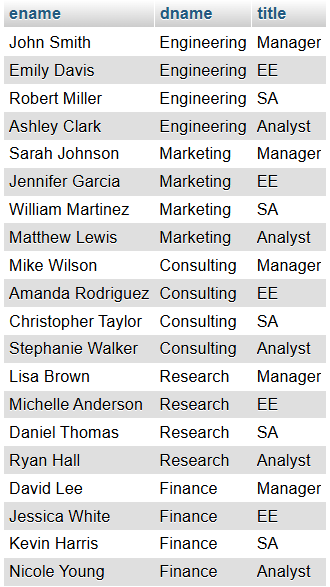
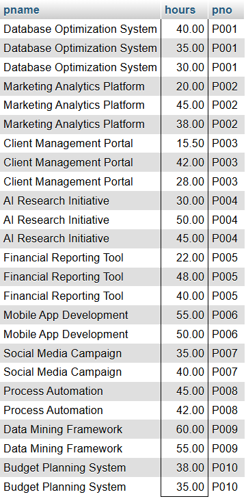
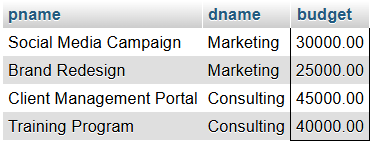
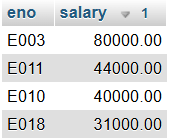
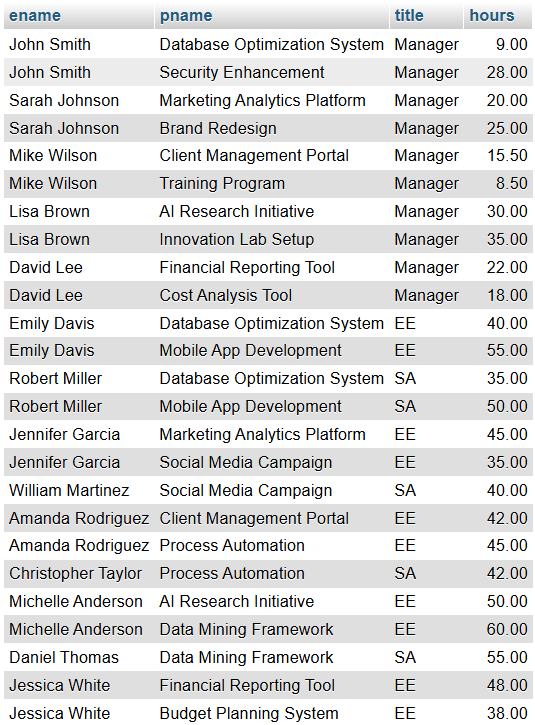

# Question 1

## Database Schema:
```
    emp (eno, ename, bdate, title, salary, dno)
    proj (pno, pname, budget, dno)
    dept (dno, dname, mgreno)
    workson (eno, pno, resp, hours)
```


## DATA POPULATION QUERIES 
Insert sample data into tables

```sql
-- First, create the tables (if they don't exist)
CREATE TABLE IF NOT EXISTS dept (
    dno VARCHAR(10) PRIMARY KEY,
    dname VARCHAR(50) NOT NULL,
    mgreno VARCHAR(10)
);

CREATE TABLE IF NOT EXISTS emp (
    eno VARCHAR(10) PRIMARY KEY,
    ename VARCHAR(50) NOT NULL,
    bdate DATE,
    title VARCHAR(20),
    salary DECIMAL(10,2),
    dno VARCHAR(10),
    FOREIGN KEY (dno) REFERENCES dept(dno)
);

CREATE TABLE IF NOT EXISTS proj (
    pno VARCHAR(10) PRIMARY KEY,
    pname VARCHAR(100) NOT NULL,
    budget DECIMAL(12,2),
    dno VARCHAR(10),
    FOREIGN KEY (dno) REFERENCES dept(dno)
);

CREATE TABLE IF NOT EXISTS workson (
    eno VARCHAR(10),
    pno VARCHAR(10),
    resp VARCHAR(50),
    hours DECIMAL(5,2),
    PRIMARY KEY (eno, pno),
    FOREIGN KEY (eno) REFERENCES emp(eno),
    FOREIGN KEY (pno) REFERENCES proj(pno)
);

-- Insert sample departments
INSERT INTO dept (dno, dname, mgreno) VALUES
('D1', 'Engineering', 'E001'),
('D2', 'Marketing', 'E002'),
('D3', 'Consulting', 'E003'),
('D4', 'Research', 'E004'),
('D5', 'Finance', 'E005');

-- Insert sample employees
INSERT INTO emp (eno, ename, bdate, title, salary, dno) VALUES
('E001', 'John Smith', '1985-03-15', 'Manager', 75000.00, 'D1'),
('E002', 'Sarah Johnson', '1988-07-22', 'Manager', 72000.00, 'D2'),
('E003', 'Mike Wilson', '1982-11-08', 'Manager', 80000.00, 'D3'),
('E004', 'Lisa Brown', '1990-01-12', 'Manager', 78000.00, 'D4'),
('E005', 'David Lee', '1986-09-30', 'Manager', 85000.00, 'D5'),
('E006', 'Emily Davis', '1992-05-18', 'EE', 45000.00, 'D1'),
('E007', 'Robert Miller', '1989-12-03', 'SA', 38000.00, 'D1'),
('E008', 'Jennifer Garcia', '1991-08-14', 'EE', 42000.00, 'D2'),
('E009', 'William Martinez', '1987-04-25', 'SA', 36000.00, 'D2'),
('E010', 'Amanda Rodriguez', '1993-10-07', 'EE', 40000.00, 'D3'),
('E011', 'Christopher Taylor', '1984-06-19', 'SA', 44000.00, 'D3'),
('E012', 'Michelle Anderson', '1990-02-28', 'EE', 41000.00, 'D4'),
('E013', 'Daniel Thomas', '1988-11-16', 'SA', 39000.00, 'D4'),
('E014', 'Jessica White', '1992-09-11', 'EE', 43000.00, 'D5'),
('E015', 'Kevin Harris', '1985-12-24', 'SA', 37000.00, 'D5'),
('E016', 'Ashley Clark', '1991-07-06', 'Analyst', 32000.00, 'D1'),
('E017', 'Matthew Lewis', '1989-03-21', 'Analyst', 33000.00, 'D2'),
('E018', 'Stephanie Walker', '1993-01-09', 'Analyst', 31000.00, 'D3'),
('E019', 'Ryan Hall', '1987-08-17', 'Analyst', 34000.00, 'D4'),
('E020', 'Nicole Young', '1990-05-13', 'Analyst', 35000.00, 'D5');

-- Insert sample projects
INSERT INTO proj (pno, pname, budget, dno) VALUES
('P001', 'Database Optimization System', 150000.00, 'D1'),
('P002', 'Marketing Analytics Platform', 75000.00, 'D2'),
('P003', 'Client Management Portal', 45000.00, 'D3'),
('P004', 'AI Research Initiative', 200000.00, 'D4'),
('P005', 'Financial Reporting Tool', 85000.00, 'D5'),
('P006', 'Mobile App Development', 120000.00, 'D1'),
('P007', 'Social Media Campaign', 30000.00, 'D2'),
('P008', 'Process Automation', 95000.00, 'D3'),
('P009', 'Data Mining Framework', 180000.00, 'D4'),
('P010', 'Budget Planning System', 65000.00, 'D5'),
('P011', 'Security Enhancement', 110000.00, 'D1'),
('P012', 'Brand Redesign', 25000.00, 'D2'),
('P013', 'Training Program', 40000.00, 'D3'),
('P014', 'Innovation Lab Setup', 160000.00, 'D4'),
('P015', 'Cost Analysis Tool', 55000.00, 'D5');

-- Insert sample workson records
INSERT INTO workson (eno, pno, resp, hours) VALUES
('E001', 'P001', 'Manager', 9),
('E006', 'P001', 'Developer', 40.0),
('E007', 'P001', 'Analyst', 35.0),
('E016', 'P001', 'Tester', 30.0),
('E002', 'P002', 'Manager', 20.0),
('E008', 'P002', 'Developer', 45.0),
('E017', 'P002', 'Analyst', 38.0),
('E003', 'P003', 'Manager', 15.5),
('E010', 'P003', 'Developer', 42.0),
('E018', 'P003', 'Support', 28.0),
('E004', 'P004', 'Manager', 30.0),
('E012', 'P004', 'Researcher', 50.0),
('E019', 'P004', 'Analyst', 45.0),
('E005', 'P005', 'Manager', 22.0),
('E014', 'P005', 'Developer', 48.0),
('E020', 'P005', 'Analyst', 40.0),
('E006', 'P006', 'Lead Developer', 55.0),
('E007', 'P006', 'Developer', 50.0),
('E008', 'P007', 'Campaign Manager', 35.0),
('E009', 'P007', 'Designer', 40.0),
('E010', 'P008', 'Process Analyst', 45.0),
('E011', 'P008', 'Developer', 42.0),
('E012', 'P009', 'Data Scientist', 60.0),
('E013', 'P009', 'Analyst', 55.0),
('E014', 'P010', 'Financial Analyst', 38.0),
('E015', 'P010', 'Developer', 35.0),
('E001', 'P011', 'Project Lead', 28.0),
('E016', 'P011', 'Security Analyst', 45.0),
('E002', 'P012', 'Creative Director', 25.0),
('E017', 'P012', 'Designer', 30.0),
('E003', 'P013', 'Training Manager', 8.5),
('E018', 'P013', 'Coordinator', 12.0),
('E004', 'P014', 'Research Director', 35.0),
('E019', 'P014', 'Lab Assistant', 40.0),
('E005', 'P015', 'Financial Manager', 18.0),
('E020', 'P015', 'Cost Analyst', 32.0);

-- Update manager references in dept table
UPDATE dept SET mgreno = 'E001' WHERE dno = 'D1';
UPDATE dept SET mgreno = 'E002' WHERE dno = 'D2';
UPDATE dept SET mgreno = 'E003' WHERE dno = 'D3';
UPDATE dept SET mgreno = 'E004' WHERE dno = 'D4';
UPDATE dept SET mgreno = 'E005' WHERE dno = 'D5';
```

## Solutions

**a)** Write an SQL query that returns the project number and name for projects with a budget greater than $100,000.

```sql
SELECT pno, pname
FROM proj
WHERE budget > 100000;
```


**b)** Write an SQL query that returns all works on records where hours worked is less than 10 and the responsibility is 'Manager'.

```sql
SELECT *
FROM workson
WHERE hours < 10 AND resp = 'Manager';
```


**c)** Write an SQL query that returns the employees (number and name only) who have a title of 'EE' or 'SA' and make more than $35,000.

```sql
SELECT eno, ename
FROM emp
WHERE (title = 'EE' OR title = 'SA') AND salary > 35000;
```


**d)** Write an SQL query that returns the employees (name only) in department 'D1' ordered by decreasing salary.

```sql
SELECT ename
FROM emp
WHERE dno = 'D1'
ORDER BY salary DESC;
```


**e)** Write an SQL query that returns the departments (all fields) ordered by ascending department name.

```sql
SELECT *
FROM dept
ORDER BY dname ASC;
```


**f)** Write an SQL query that returns the employee name, department name, and employee title.

```sql
SELECT e.ename, d.dname, e.title
FROM emp e
JOIN dept d ON e.dno = d.dno;
```


**g)** Write an SQL query that returns the project name, hours worked, and project number for all works on records where hours > 10.

```sql
SELECT p.pname, w.hours, p.pno
FROM proj p
JOIN workson w ON p.pno = w.pno
WHERE w.hours > 10;
```


**h)** Write an SQL query that returns the project name, department name, and budget for all projects with a budget < $50,000.

```sql
SELECT p.pname, d.dname, p.budget
FROM proj p
JOIN dept d ON p.dno = d.dno
WHERE p.budget < 50000;
```


**i)** Write an SQL query that returns the employee numbers and salaries of all employees in the 'Consulting' department ordered by descending salary.

```sql
SELECT e.eno, e.salary
FROM emp e
JOIN dept d ON e.dno = d.dno
WHERE d.dname = 'Consulting'
ORDER BY e.salary DESC;
```


**j)** Write an SQL query that returns the employee name, project name, employee title, and hours for all works on records.

```sql
SELECT e.ename, p.pname, e.title, w.hours
FROM emp e
JOIN workson w ON e.eno = w.eno
JOIN proj p ON w.pno = p.pno;
```


