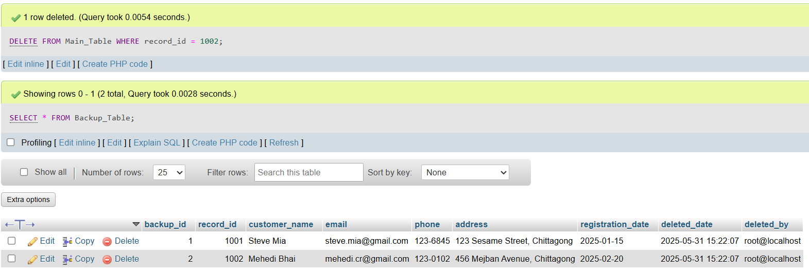

# Trigger *(Dont get Triggered)*

## Database Creation
```sql
CREATE DATABASE TriggerLab;
USE TriggerLab;
```


## Solutions

### **a.**	Write a SQL program which automatically preserves the updated salary of an employee in a separate table.

1. Create **Employee** table
```sql
CREATE TABLE Employee (
    emp_id INT PRIMARY KEY,
    emp_name VARCHAR(100) NOT NULL,
    department VARCHAR(50),
    salary DECIMAL(10,2) NOT NULL,
    hire_date DATE
);
```


2. Create **Salary_History** table
```sql
CREATE TABLE Salary_History (
    history_id INT AUTO_INCREMENT PRIMARY KEY,
    emp_id INT,
    old_salary DECIMAL(10,2),
    new_salary DECIMAL(10,2),
    update_date TIMESTAMP DEFAULT CURRENT_TIMESTAMP,
    updated_by VARCHAR(50),
    FOREIGN KEY (emp_id) REFERENCES Employee(emp_id)
);
```


3. Insert dummy data into **Employee** table
```sql
INSERT INTO Employee (emp_id, emp_name, department, salary, hire_date) VALUES
(101, 'John Smith', 'IT', 45000.00, '2025-01-15'),
(102, 'Sarah Johnson', 'HR', 40000.00, '2024-09-20'),
(103, 'Mike Davis', 'Finance', 50000.00, '2024-06-10'),
(104, 'Lisa Wilson', 'IT', 48000.00, '2025-02-05'),
(105, 'David Brown', 'Marketing', 42000.00, '2025-02-12');
```


4. Create trigger for salary updates
```sql
DELIMITER $$
CREATE TRIGGER salary_update_trigger
    AFTER UPDATE ON Employee
    FOR EACH ROW
BEGIN
    -- Only log if salary has actually changed
    IF OLD.salary != NEW.salary THEN
        INSERT INTO Salary_History (emp_id, old_salary, new_salary, updated_by)
        VALUES (NEW.emp_id, OLD.salary, NEW.salary, USER());
    END IF;
END$$
DELIMITER ;
```


5. Test the salary update trigger
```sql
UPDATE Employee SET salary = 50000.00 WHERE emp_id = 101;
UPDATE Employee SET salary = 45000.00 WHERE emp_id = 102;

SELECT * FROM Salary_History;
```


### **b.**	Write a SQL program which automatically preserves the deleted record of a Main table in a Backup table.

1. Create **Main_Table**
```sql
CREATE TABLE Main_Table (
    record_id INT PRIMARY KEY,
    customer_name VARCHAR(100) NOT NULL,
    email VARCHAR(100),
    phone VARCHAR(20),
    address TEXT,
    registration_date DATE
);
```


2. Create **Backup_Table**
```sql
CREATE TABLE Backup_Table (
    backup_id INT AUTO_INCREMENT PRIMARY KEY,
    record_id INT,
    customer_name VARCHAR(100),
    email VARCHAR(100),
    phone VARCHAR(20),
    address TEXT,
    registration_date DATE,
    deleted_date TIMESTAMP DEFAULT CURRENT_TIMESTAMP,
    deleted_by VARCHAR(50)
);
```


3. Insert dummy data into **Main_Table**
```sql
INSERT INTO Main_Table (record_id, customer_name, email, phone, address, registration_date) VALUES
(1001, 'Steve Mia', 'steve.mia@gmail.com', '123-6845', '123 Sesame Street, Chittagong', '2025-01-15'),
(1002, 'Mehedi Bhai', 'mehedi.cr@gmail.com', '123-0102', '456 Mejban Avenue, Chittagong', '2025-02-20'),
(1003, 'Somonnoyok Sayem', 'sayem.haray_gese@gmail.com', '123-0134', '789 New Market, Chittagong', '2025-03-10'),
(1004, 'Atahar Jomidar', 'atahar.jomidar@gmail.com', '123-0114', '321 Jomidar Para, Chittagong', '2025-04-05'),
(1005, 'Mr. Babu', 'gm.babu@gmail.com', '123-0505', '654 GEC More, Chittagong', '2025-05-12');
```


4. Create trigger for deleted record backup
```sql
DELIMITER $$
CREATE TRIGGER backup_deleted_records
    BEFORE DELETE ON Main_Table
    FOR EACH ROW
BEGIN
    INSERT INTO Backup_Table (
        record_id, customer_name, email, phone, address, 
        registration_date, deleted_by
    )
    VALUES (
        OLD.record_id, OLD.customer_name, OLD.email, OLD.phone, 
        OLD.address, OLD.registration_date, USER()
    );
END$$
DELIMITER ;
```


5. Test the delete backup trigger
```sql
DELETE FROM Main_Table WHERE record_id = 1001;
DELETE FROM Main_Table WHERE record_id = 1002;

SELECT * FROM Backup_Table;
```



### **c.**	Write a SQL program which automatically calculates the total marks and the percentage marks when student’s English, Physics, Chemistry and Mathematics marks are inserted.

1. Create **Student_Marks** table
```sql
CREATE TABLE Student_Marks (
    student_id INT PRIMARY KEY,
    student_name VARCHAR(100) NOT NULL,
    class VARCHAR(20),
    english_marks INT CHECK (english_marks >= 0 AND english_marks <= 100),
    physics_marks INT CHECK (physics_marks >= 0 AND physics_marks <= 100),
    chemistry_marks INT CHECK (chemistry_marks >= 0 AND chemistry_marks <= 100),
    mathematics_marks INT CHECK (mathematics_marks >= 0 AND mathematics_marks <= 100),
    total_marks INT,
    percentage_marks DECIMAL(5,2),
    entry_date TIMESTAMP DEFAULT CURRENT_TIMESTAMP
);
```


2. Create trigger for marks calculation on INSERT
```sql
DELIMITER $
CREATE TRIGGER calculate_marks_insert
    BEFORE INSERT ON Student_Marks
    FOR EACH ROW
BEGIN
    DECLARE total INT;
    DECLARE percentage DECIMAL(5,2);
    
    -- Calculate total marks (out of 400)
    SET total = NEW.english_marks + NEW.physics_marks + NEW.chemistry_marks + NEW.mathematics_marks;
    
    -- Calculate percentage
    SET percentage = (total / 400.0) * 100;
    
    -- Set the calculated values
    SET NEW.total_marks = total;
    SET NEW.percentage_marks = percentage;
END$
DELIMITER ;
```


3. Insert dummy data to test marks calculation
```sql
INSERT INTO Student_Marks (student_id, student_name, class, english_marks, physics_marks, chemistry_marks, mathematics_marks)
VALUES 
(2001, 'Steve Mia', '12th', 85, 90, 88, 92),
(2002, 'Mehedi Bhai', '12th', 78, 82, 75, 80),
(2003, 'Somonnoyok Sayem', '12th', 65, 70, 68, 72),
(2004, 'Atahar Jomidar', '12th', 95, 94, 96, 98),
(2005, 'Mr. Babu', '12th', 45, 50, 48, 52);
```


4. Test the marks calculation (INSERT trigger results)
```sql
SELECT student_name, class, english_marks, physics_marks, chemistry_marks, mathematics_marks, 
       total_marks, percentage_marks
FROM Student_Marks
ORDER BY student_id;
```


## Show all triggers
```sql
SHOW TRIGGERS;
```

