# MongoDB NoSQL Conversion and Queries

Collection Name: `people`

## DATA INSERTION

Converting table to MongoDB documents

```js
db.people.insertMany([
  {
    Name: "John",
    Age: 25,
    City: "New York",
    Occupation: "Engineer",
  },
  {
    Name: "Emily",
    Age: 30,
    City: "Los Angeles",
    Occupation: "Lawyer",
  },
  {
    Name: "Michael",
    Age: 40,
    City: "Chicago",
    Occupation: "Doctor",
  },
  {
    Name: "Sarah",
    Age: 35,
    City: "Houston",
    Occupation: "Teacher",
  },
  {
    Name: "David",
    Age: 28,
    City: "San Francisco",
    Occupation: "Software Engineer",
  },
  {
    Name: "Jessica",
    Age: 45,
    City: "Miami",
    Occupation: "Nurse",
  },
  {
    Name: "Ryan",
    Age: 32,
    City: "Seattle",
    Occupation: "Architect",
  },
  {
    Name: "Amanda",
    Age: 29,
    City: "Boston",
    Occupation: "Marketing Specialist",
  },
  {
    Name: "Daniel",
    Age: 33,
    City: "Denver",
    Occupation: "Chef",
  },
  {
    Name: "Olivia",
    Age: 27,
    City: "Atlanta",
    Occupation: "Graphic Designer",
  },
  {
    Name: "Matthew",
    Age: 38,
    City: "Dallas",
    Occupation: "Business Analyst",
  },
  {
    Name: "Ashley",
    Age: 31,
    City: "Phoenix",
    Occupation: "Accountant",
  },
  {
    Name: "Jacob",
    Age: 36,
    City: "Philadelphia",
    Occupation: "Consultant",
  },
  {
    Name: "Elizabeth",
    Age: 26,
    City: "San Diego",
    Occupation: "Journalist",
  },
  {
    Name: "William",
    Age: 42,
    City: "Austin",
    Occupation: "Entrepreneur",
  },
]);
```

## Solution

**a)** Find all documents

```js
db.people.find();
```

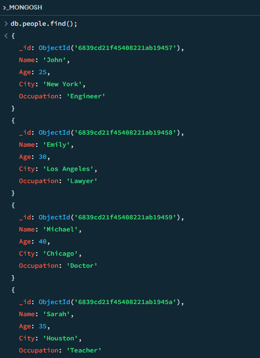

**b)** Find documents where Age is greater than 30

```js
db.people.find({ Age: { $gt: 30 } });
```

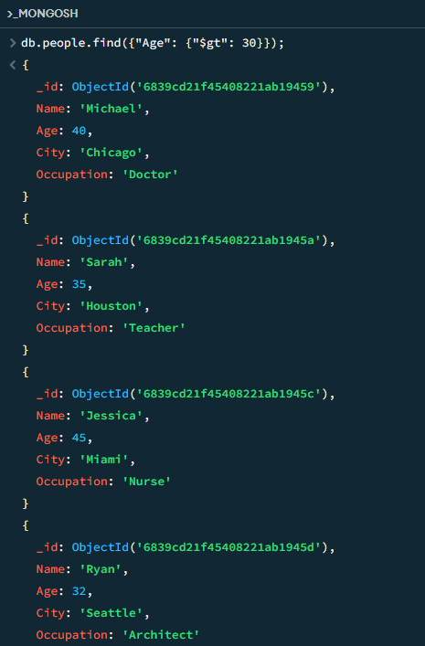

**c)** Find documents where City is "New York"

```js
db.people.find({ City: "New York" });
```

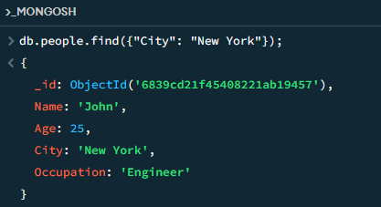

**d)** Find documents where Occupation is "Engineer"

```js
db.people.find({ Occupation: "Engineer" });
```

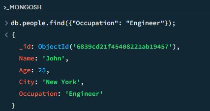

**e)** Find documents where Name starts with "J"

```js
db.people.find({ Name: { $regex: "^J" } });
```

or

```js
db.people.find({ Name: /^J/ });
```

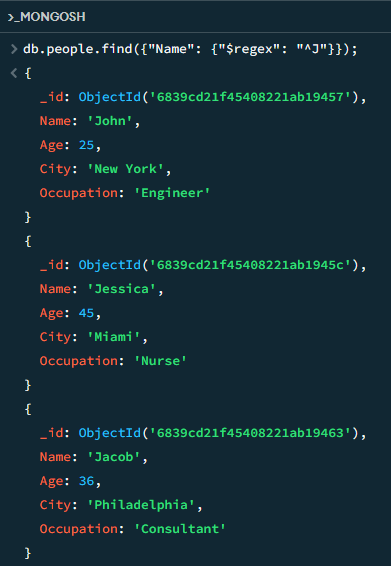

**f)** Find documents where Age is between 30 and 40 (inclusive)

```js
db.people.find({ Age: { $gte: 30, $lte: 40 } });
```

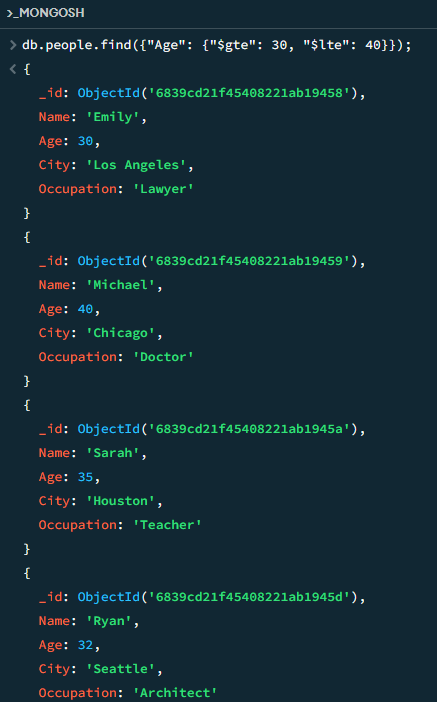

**g)** Find documents where Occupation is not "Teacher"

```js
db.people.find({ Occupation: { $ne: "Teacher" } });
```

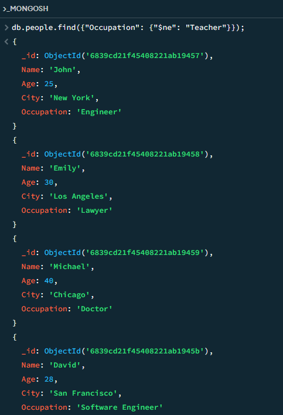

**h)** Find documents where City is in a list of cities

```js
db.people.find({ City: { $in: ["New York", "Houston"] } });
```

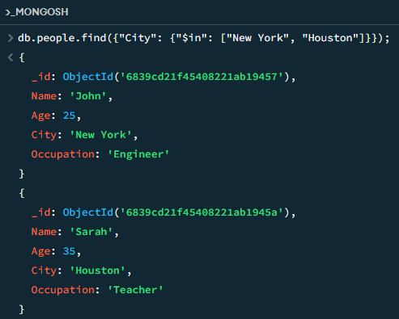

**i)** Find the document with the highest Age

```js
db.people.find().sort({ Age: -1 }).limit(1);
```

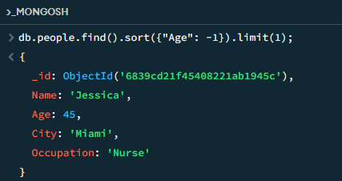

**j)** Find the average Age of all documents

```js
db.people.aggregate([
  {
    $group: {
      _id: null,
      averageAge: { $avg: "$Age" },
    },
  },
]);
```

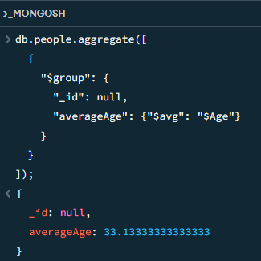

**k)** Find documents where the Name contains a specific substring (example: contains "mat")

```js
db.people.find({ Name: { $regex: "mat", $options: "i" } });
```

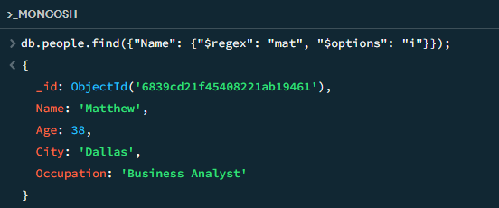

**l)** Find the number of documents in each city

```js
db.people.aggregate([
  {
    $group: {
      _id: "$City",
      count: { $sum: 1 },
    },
  },
  {
    $sort: { count: -1 },
  },
]);
```

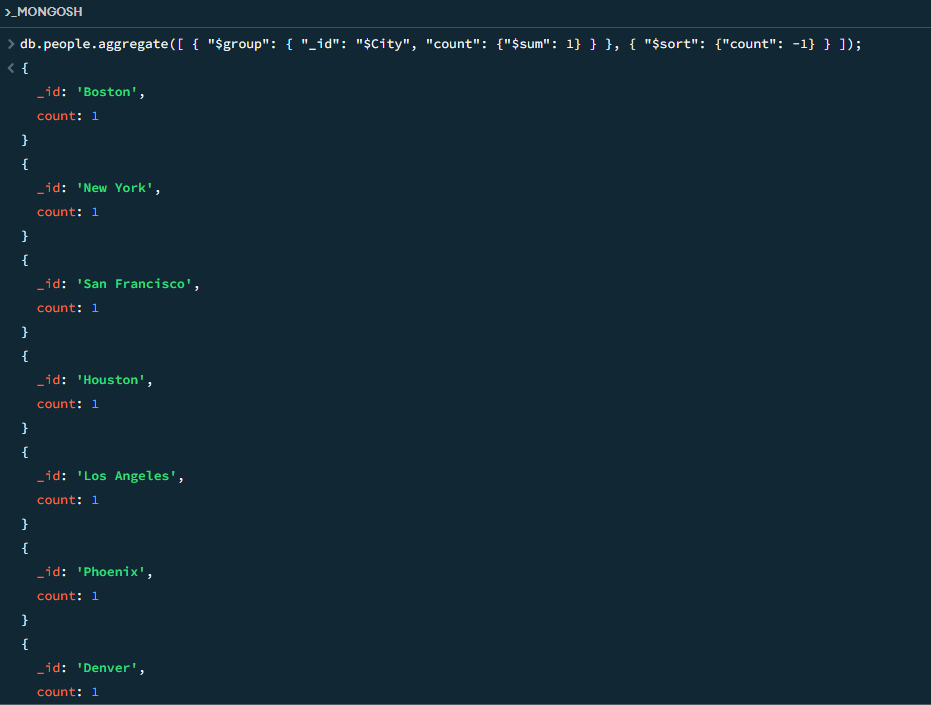

**m)** Find documents where Age is less than or equal to 30 and Occupation is "Engineer"

```js
db.people.find({ Age: { $lte: 30 }, Occupation: "Engineer" });
```

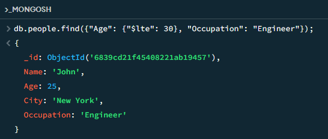
