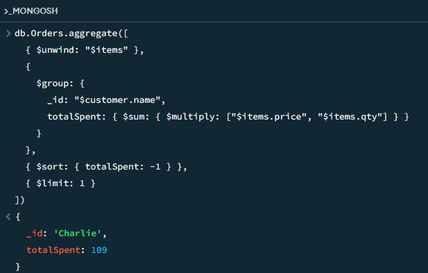
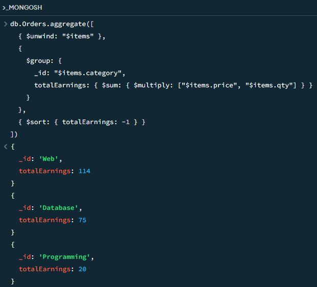
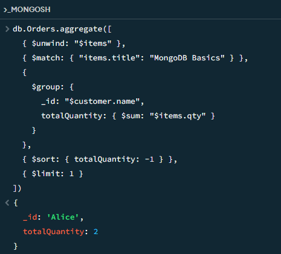
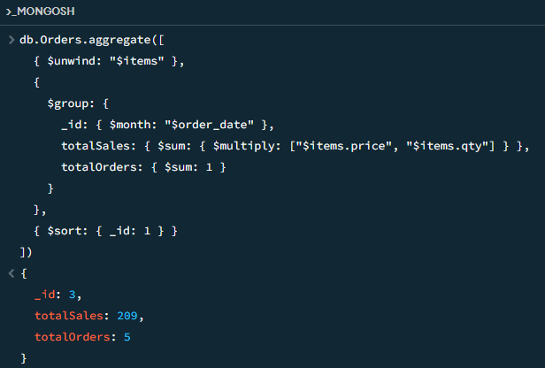

# Bookstore Database

## Insert
```js
db.Orders.insertMany([
  {
    _id: 1,
    customer: { name: "Alice", country: "USA" },
    items: [
      { title: "MongoDB Basics", category: "Database", price: 25, qty: 2 },
      { title: "Node.js in Action", category: "Web", price: 30, qty: 1 }
    ],
    order_date: ISODate("2024-03-10")
  },
  {
    _id: 2,
    customer: { name: "Bob", country: "UK" },
    items: [
      { title: "Python 101", category: "Programming", price: 20, qty: 1 }
    ],
    order_date: ISODate("2024-03-11")
  },
  {
    _id: 3,
    customer: { name: "Charlie", country: "USA" },
    items: [
      { title: "MongoDB Basics", category: "Database", price: 25, qty: 1 },
      { title: "JavaScript Guide", category: "Web", price: 28, qty: 3 }
    ],
    order_date: ISODate("2024-03-13")
  }
])
```

## Solutions

**a.** Find the most loyal customer *(by total spending)*

```js
db.Orders.aggregate([
  { $unwind: "$items" },
  { 
    $group: {
      _id: "$customer.name",
      totalSpent: { $sum: { $multiply: ["$items.price", "$items.qty"] } }
    }
  },
  { $sort: { totalSpent: -1 } },
  { $limit: 1 }
])
```


**b.** Category-wise earnings
```js
db.Orders.aggregate([
  { $unwind: "$items" },
  { 
    $group: {
      _id: "$items.category",
      totalEarnings: { $sum: { $multiply: ["$items.price", "$items.qty"] } }
    }
  },
  { $sort: { totalEarnings: -1 } }
])
```


**c.** Who loves "MongoDB Basics" the most?
```js
db.Orders.aggregate([
  { $unwind: "$items" },
  { $match: { "items.title": "MongoDB Basics" } },
  { 
    $group: {
      _id: "$customer.name",
      totalQuantity: { $sum: "$items.qty" }
    }
  },
  { $sort: { totalQuantity: -1 } },
  { $limit: 1 }
])
```


**d.** Monthly Sales Summary
```js
db.Orders.aggregate([
  { $unwind: "$items" },
  { 
    $group: {
      _id: { $month: "$order_date" },
      totalSales: { $sum: { $multiply: ["$items.price", "$items.qty"] } },
      totalOrders: { $sum: 1 }
    }
  },
  { $sort: { _id: 1 } }
])
```

